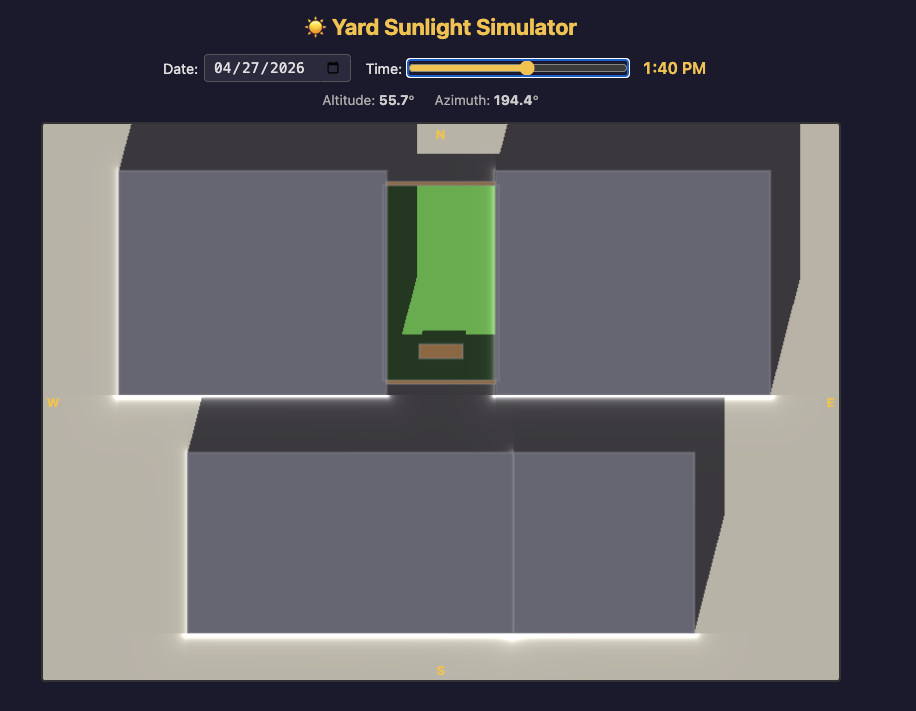

# ☀️ Yard Sunlight Simulator

A WebGL 2 simulation that visualizes shadows cast across a residential yard throughout the day. Renders accurate solar positions and real-time shadow mapping using analytical ray-box intersection in a fragment shader.



## Running

The app loads GLSL shaders via `fetch()`, so it must be served over HTTP (not `file://`).

```bash
npm start
# or
python3 -m http.server
```

Then open [http://localhost:3000](http://localhost:3000) (or whichever port your server reports).

## Controls

| Control | Input | Effect |
|---------|-------|--------|
| **Date** | Date picker | Sets the calendar date for solar position calculation |
| **Time** | Range slider (5 AM – 9 PM) | Moves the sun to the selected time of day |
| **Arrow keys** | ← / → | Nudges time ±15 minutes |

The time slider defaults to the current time of day on page load. Sun altitude and azimuth are displayed below the controls.

## Architecture

```
index.html          Minimal HTML shell — controls, canvas, compass labels
styles.css          Dark theme styling
shared.js           Shared ES module: solar math, geometry, ray-box intersection
shader.js           WebGL setup, render loop, UI (imports shared.js)
vertex.glsl         Passthrough vertex shader (clip-space → UV)
fragment.glsl       Core rendering: shadow casting, bounce lighting, coloring
analysis/
  analyze.mjs       Node.js script — yearly sunlight data → CSV
  chart.html        Chart.js visualization of the CSV data
  sun-hours-heatmap.mjs  Node.js script — yard sunlight-hours heatmap → CSV
  sun-hours-heatmap.html Heatmap viewer for yard-wide sun exposure
  sunlight-2026.csv Generated output
```

**Solar position** is computed using NOAA-style astronomical formulas (Julian day → solar declination → hour angle → altitude/azimuth), with automatic PST/PDT timezone handling.

**Scene geometry** is defined as axis-aligned boxes passed to the shader as uniforms:

| Index | Object | Height |
|-------|--------|--------|
| 0–3 | Surrounding houses | 25 ft |
| 4–7 | Yard perimeter fence | 6 ft |
| 8 | Outdoor table | 4 ft |
| 9–10 | Bench seats | 2 ft |

Coordinate system: **X = East, Y = North, Z = Up**. The 15 ft × 27 ft yard is centered at the origin.

## Rendering Techniques

### Analytical Ray-Box Intersection (Shadow Casting)

For each ground pixel, a ray is cast from the surface toward the sun direction and tested against all scene boxes using the **slab method** (analytical ray-AABB intersection). This produces mathematically exact shadow edges with no aliasing artifacts.

### Single-Bounce Indirect Lighting

The surrounding houses have white-painted walls (reflectivity 0.80). The shader estimates indirect illumination by checking all four vertical faces of each house:

- Compute solar irradiance on the wall face (`dot(sun, normal)`)
- Calculate a distance-based form factor from the wall to the ground point
- Accumulate the reflected contribution, scaled by `BOUNCE_SCALE`

This produces subtle fill light in areas adjacent to sun-lit walls, even when the ground point itself is in shadow.

### Daylight & Horizon

A `smoothstep` fade between sun altitudes of −0.02 and 0.18 radians simulates twilight transitions. Below the horizon, the scene dims to 10% brightness.

### Outlines

Building and fence edges are rendered with a signed-distance outline (1.8 px wide, blended at 45% opacity) for visual clarity in the top-down view.

## Yearly Sunlight Analysis

The `analysis/` directory contains a Node.js script that computes the percentage of the yard in direct sunlight at **solar noon** for every day of a given year.

```bash
node analysis/analyze.mjs 2026    # generates analysis/sunlight-2026.csv
```

The script uses the same solar math and ray-box intersection as the WebGL simulator, but runs headlessly on a 60×60 sample grid across the yard. It evaluates at true solar noon (when the sun is highest) rather than 12:00 PM clock time, avoiding artifacts from DST transitions.

Open `analysis/chart.html` (served over HTTP) to see an interactive Chart.js line chart of the results. The chart shows a clear seasonal pattern for Seattle:

- **Winter (Nov–Jan):** ~0% — low sun angle means surrounding 25 ft houses fully shadow the yard
- **Spring (Mar–Apr):** 10–30% — sun climbs above the rooflines
- **Summer (May–Jun):** ~40% peak — highest sun altitude (~62° at solstice)
- **Fall (Sep–Oct):** drops back to 0% as shadows lengthen

## Yard Sunlight Heatmap (Daily Light Integral)

The heatmap shows **Daily Light Integral (DLI, mol/m²/day)** — the cumulative photosynthetically active radiation received during the growing season (April 1 – September 1, 9am–5pm).

**Why DLI matters:** Unlike raw sun-hours (which treat 7am and noon the same), DLI accounts for the fact that midday sun delivers far more energy. This makes DLI the industry standard metric for plant growth decisions in horticulture.

### Generation

```bash
node analysis/sun-hours-heatmap.mjs 2026    # generates analysis/sun-hours-heatmap-2026.csv
```

The script samples every 5 minutes during the growing season window. For each sample:

1. **Clear-sky irradiance:** Compute Direct Normal Irradiance (DNI) using the Meinel model: `DNI = 1361 × 0.7^(AM^0.678)` W/m², where air mass (AM) depends on sun altitude
2. **PAR split:** Break into direct + diffuse components; apply 45% PAR (photosynthetically active radiation, 400–700 nm) fraction
3. **PPFD conversion:** Convert to photon flux density (µmol/m²/s) using standard factor 4.57
4. **Shadow handling:**
   - **Unshaded ground:** receives direct + diffuse PAR
   - **Shaded ground:** receives diffuse-only PAR (realistic, since sky light still reaches it)
5. **Accumulation:** Sum DLI across all samples: `DLI = Σ(PPFD × 300s) / 1,000,000 mol/m²`

### Manual Regeneration

To regenerate the heatmap for a different year or adjust sampling parameters:

```bash
# Regenerate for a specific year
node analysis/sun-hours-heatmap.mjs 2027    # generates analysis/sun-hours-heatmap-2027.csv
```

**Modifying the script:**

Edit `analysis/sun-hours-heatmap.mjs` to customize:

- **`SAMPLE_STEP_MIN`** — Sampling interval (currently 5 minutes). Smaller values = smoother heatmap but longer generation time. Typical range: 5–15 minutes.
- **Date range** — Change `new Date(YEAR, 3, 1)` (April 1) and `new Date(YEAR, 8, 1)` (September 1) to different months/days for different seasons.
- **Time window** — Modify `totalMin = 540` (9am) and `totalMin <= 1020` (5pm) to sample different hours of the day.
- **Grid resolution** — Adjust `GRID_X` and `GRID_Y` for finer/coarser spatial sampling (currently 0.25 ft resolution).

**Example: Full year, 24-hour sampling at 15-min intervals:**

```javascript
const start = new Date(YEAR, 0, 1);      // Jan 1
const end = new Date(YEAR, 11, 31);     // Dec 31
const SAMPLE_STEP_MIN = 15;             // 15-min samples
// Change loop: for (let totalMin = 0; totalMin < 24 * 60; totalMin += SAMPLE_STEP_MIN)
```

After modifying, regenerate and the script will print progress to stderr. The CSV will be output to `analysis/sun-hours-heatmap-{YEAR}.csv`. Reload `analysis/sun-hours-heatmap.html` (the viewer auto-loads the CSV for the current year).

### Interpretation

The heatmap colors represent average daily DLI during the season. Use these ranges to choose plants:

| Plant Type | DLI Range | Examples |
|-----------|-----------|----------|
| **Full sun** | 20–40 mol/m²/day | Tomatoes, peppers, basil, lettuce (open), potatoes |
| **Partial shade** | 10–20 mol/m²/day | Lettuce (filtered), herbs, ferns, hostas, shade vegetables |
| **Full shade** | 5–10 mol/m²/day | Hostas, shade ferns, foliage plants |

Even shadowed areas receive diffuse sky light and register nonzero DLI, making the heatmap valuable for both sunny and shade-plant planning.

Open `analysis/sun-hours-heatmap.html` (served over HTTP) to view the interactive heatmap with hover tooltips.
